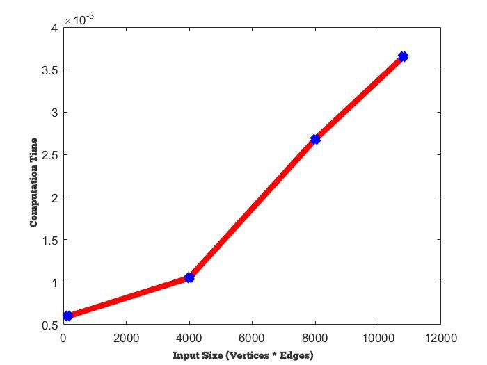

# Assignment 3  
[CSN- 212] [Assignment #3] This repository contains the implementation of 'Bellman Ford's Algorithm for finding the shortest paths from a single source vertex to all of the other vertices in a weighted digraph.
  
## Problem  
Implement Bellman Ford Algorithm and run it for a number of a number of inputs. 
Chart showing the running time vs input (vertices and edges)
  
#### Solution -  
The graph shown below consists of 4 input test cases and the corresponding running times.
  
